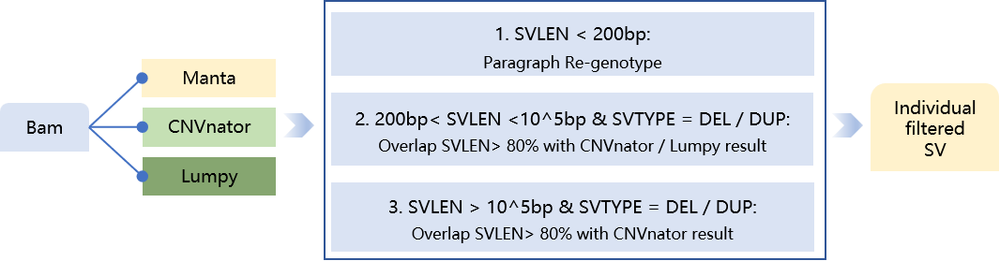

# Manta SV filter workflow
Developed based on paired-read mapping, read splitting, and read assembly strategies, Manta outperforms other tools in the accuracy of SV (structural variation) detection in NGS data and remains competitive compared to tools for third-generation sequencing. 
Its advantages include faster speed, precise breakpoint identification, and relatively comprehensive SV type coverage. However, since it does not utilize read-depth strategies for identifying copy number variations (CNVs), its results may contain a certain number of false-positive deletions and duplications. 
Therefore, we selected two read-depth-based tools, CNVnator and Lumpy, along with the SV genotyping refinement tool Paragraph, to filter Manta's results and remove false-positive SVs.

### Pipeline Overview：
1. SV Calling: Detect structural variations (SVs) in each individual using Manta, Lumpy, and CNVnator.
2. SV Information Extraction: Use BEDTools to extract SV details (chromosome, start, end, SV type, SV length) from the VCF files of Lumpy and CNVnator.
3. SV Splitting by Length: Split Manta-called SVs into two groups based on length >200 bp and ≤200 bp.
4. Genotype Refinement: Input SVs ≤200 bp into Paragraph for genotype refinement (special handling required for INS and INV).
5. Filtering Process: Input Manta SVs, Lumpy SV BED, CNVnator SV BED, and Paragraph SV info into manta_qc.py.
6. Perform stepwise filtering (as illustrated in the workflow).
7. Output two files[output_prefix]_qc_by_lumpy_cnvnator_paragraph_mark_no_header.vcf: Contains filtered results with annotations (no VCF header)；[output_prefix]_qc_by_lumpy_cnvnator_paragraph_filtered_no_header.vcf: Contains only high-confidence SVs after removing false positives (no VCF header).
8. Header Addition: Append the VCF header to the two output files.
